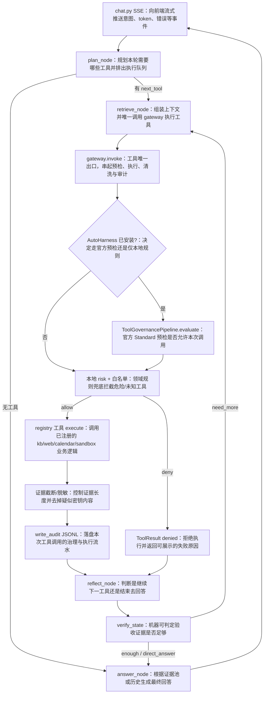

# Omni-Butler Harness 治理层完整逻辑说明

> 覆盖范围：Agent Harness 升级中的 **H1（Tool Registry + Gateway）**、**H2（Verifier + Audit）**、**H3（长期记忆 MVP）**、**H4（办公评测）**，以及对接 aiming-lab AutoHarness `0.1.0` 后的行为。  
> RAG **retrieval-resume**（邻接扩展 + 智谱 Rerank）已在 `app/rag/expand.py` / `rerank.py` / `retrieval.py` 落地，详见 `app/eval/README.md` §1b。

---

## 1. 改进要解决什么问题

改造前，四类工具（知识库 / 联网 / 日程 / 沙箱）的执行逻辑全部写在 [`workflow.py`](../workflow.py) 的 `retrieve_node` 里，用一长串 `if/elif` 分支硬编码。结果是：

| 问题 | 影响 |
|------|------|
| 工具与编排耦合 | 加工具必须改巨型 workflow |
| 无统一准入门 | 缺少白名单、风险分级、参数拦截 |
| 反思偏弱 | 主要靠队列是否跑完，缺少「作业验收」 |
| 无可审计轨迹 | 出问题时难追溯「调了谁、为何拒绝」 |

本次改进把职责拆开：

- **LangGraph**：仍负责外环 `plan → retrieve → reflect → answer`
- **Gateway**：唯一工具出口，负责治理（AutoHarness + 本地兜底）
- **Tools**：纯业务执行
- **Verify**：回答前可判定校验
- **Audit**：JSONL 流水账

核心公式：

```text
Agent = Model + Harness
Harness（本仓库）= LangGraph 外环 + Gateway 治理 + Tool Registry + Verify + Audit
```

---

## 2. 完整运行时逻辑（端到端）



### 2.1 逐步说明

1. **plan_node**  
   用 LLM 或启发式决定需要哪些工具，排出队列（如 `kb → web`），设置 `next_tool` / `pending_tools`。

2. **retrieve_node**  
   不再内嵌业务逻辑；组装 `ToolContext` + 可选 `tool_args`，调用 `gateway.invoke`，把 `ToolResult` 合并回 LangGraph state（evidence、thinking_steps、artifact 等）。

3. **gateway.invoke（治理管线）**  
   - 解析工具名  
   - 若已安装 aiming-lab AutoHarness：`evaluate(ToolCall)` 预检  
   - 本地深度防御：风险正则、sandbox 禁参、工具白名单  
   - 查 Registry 并 `execute`  
   - 清洗证据长度 / 脱敏  
   - 写审计日志  

4. **reflect_node**  
   - 有 `direct_answer`（日程补槽、治理拒绝文案等）→ 直接结束  
   - 队列未跑完 → 取下一个工具  
   - 否则调用 `verify_state`：不够则补调/重试，够则进 answer  

5. **answer_node**  
   组装证据池 prompt。有 kb/web/sandbox 证据时：成稿 → 忠实度核验 → 失败则带反馈重写一次 → 必要时短免责，再作为 `direct_answer` 发出（本文件不展开 SSE 细节）。

---

## 3. 目录与文件总览

```text
backend/app/agents/
├── workflow.py                 # LangGraph 外环（薄封装 retrieve/reflect）
├── harness/
│   ├── __init__.py             # 包导出
│   ├── constitution.yaml        # AutoHarness schema + omni 扩展
│   ├── constitution.py          # 加载 YAML / 构建 AH pipeline
│   ├── types.py                # ToolContext / ToolResult
│   ├── gateway.py              # 唯一工具出口（治理核心）
│   ├── verify.py               # 回答前校验
│   └── audit.py                # JSONL 审计
└── tools/
    ├── __init__.py             # 导入四工具以完成注册
    ├── registry.py             # ToolSpec 注册表
    ├── kb.py                   # 知识库检索
    ├── web.py                  # 联网搜索
    ├── calendar_tool.py        # 日程
    └── sandbox_tool.py         # Docker 数据分析沙箱

backend/tests/test_harness_gateway.py   # H1/H2 回归
backend/data/harness/harness-audit.jsonl # 运行时审计输出（自动生成）
```

---

## 4. 逐文件说明

### 4.1 `harness/constitution.yaml`

**功能**：治理「宪法」。上半部分符合 aiming-lab AutoHarness 官方 schema；`omni:` 块是本项目扩展（AH 会因 `extra=ignore` 忽略，由我们自己读）。

| 代码块 | 作用 | 知识点 |
|--------|------|--------|
| `mode: standard` | 锁定 Standard 管线强度（相对 Core 更完整，相对 Enhanced 无 Swarm） | Pipeline Mode / 配置驱动行为 |
| `identity` | 项目身份与边界描述 | Agent 身份配置 |
| `rules` | 行为规则（密钥、破坏性操作、沙箱禁网） | Policy as Code |
| `permissions.defaults.unknown_tool: deny` | 未声明工具默认拒绝 | 默认拒绝（deny-by-default）安全模型 |
| `permissions.tools.*` | 四工具允许策略；sandbox 为 `restricted` + `deny_patterns` | 最小权限 / 正则拒绝 |
| `risk.thresholds` | low/medium→allow，high/critical→deny | 风险分级；办公助手非交互，故 medium 不走 `ask` |
| `risk.custom_rules` | 额外高风险模式（如 network=bridge） | 规则分类器 |
| `hooks` / `audit` | AH 钩子配置与官方审计输出路径 | Hook / Observability |
| `omni.allowed_tools` 等 | 本地白名单、风险字典、长度上限、sandbox 禁参 | 双层配置：官方 schema + 领域扩展 |

---

### 4.2 `harness/constitution.py`

**功能**：读 YAML，向 gateway 提供两套东西——本地 dict、可选 AH pipeline。

| 代码块 | 作用 | 知识点 |
|--------|------|--------|
| `_DEFAULT_OMNI` | YAML 缺失时的本地默认值 | 防御性默认配置 |
| `_read_raw()` | `yaml.safe_load` 读文件 | YAML 解析；`safe_load` 防任意对象反序列化 |
| `load_constitution()` + `@lru_cache` | 合并 `omni` 扩展为 gateway 用 dict | 函数级缓存；深合并字典 |
| `get_autoharness_pipeline()` | `Constitution.from_dict` + `ToolGovernancePipeline`；失败则 `None` | 可选依赖；适配器模式 |
| 剥离 `omni` 再交给 AH | 避免未知字段干扰 AH 校验 | Schema 隔离 |
| `autoharness_available()` | 探测是否 `import autoharness` 成功 | 能力探测（capability detection） |
| `reload_constitution()` | `cache_clear` 后重载 | 测试可刷新配置；缓存失效 |

---

### 4.3 `harness/types.py`

**功能**：工具入参 / 出参的统一数据结构，衔接 gateway 与 LangGraph state。

| 代码块 | 作用 | 知识点 |
|--------|------|--------|
| `ToolContext` dataclass | 工具执行上下文：db、消息、历史、用户、文档范围、规划标志 | 上下文对象；依赖注入式传参 |
| `ToolResult` dataclass | 统一返回：证据、thinking、卡片、直接回答、拒绝信息等 | 结果对象；避免各工具返回结构不一致 |
| `update_pending_calendar` | 区分「未改日程状态」与「显式清空 pending」 | 三态问题（unset / None / value） |
| `as_state_update()` | 按 `source_type` 替换旧证据、重编号 `index`，拼 LangGraph 更新 dict | 不可变合并；状态机 partial update |

---

### 4.4 `harness/gateway.py`（核心）

**功能**：唯一工具出口。管线：

```text
parse → AutoHarness.evaluate（可选）→ 本地 risk/permission → execute → sanitize → audit
```

| 代码块 | 作用 | 知识点 |
|--------|------|--------|
| `_deny()` | 构造拒绝结果，填 `direct_answer` 便于前端直接展示 | 早返回；失败也结构化 |
| `_local_classify_risk()` | 按工具风险表 + 正则 + sandbox 禁参判定 | 正则；纵深防御（defense in depth） |
| `_local_permission_ok()` | 白名单检查 | ACL / allowlist |
| `_autoharness_precheck()` | 调 AH `evaluate(ToolCall)`；`ask` 在非交互下对高风险转 deny | 软失败（soft-fail）；非交互策略 |
| `_sanitize_evidence()` | 截断证据长度；密钥样模式脱敏为 `[REDACTED]` | 输出清洗；上下文预算 |
| `invoke()` 主流程 | 串起预检→执行→审计；audit 带 `engine=autoharness\|local` | 网关模式（Gateway Pattern） |
| thinking 追加「治理(AutoHarness/local)…」 | 让用户/开发可见治理已生效 | 可观测性 UX |

**与 AutoHarness 的边界**：

- 使用官方 **`evaluate`（只预检，不执行）**
- **执行权**仍在本仓库 Registry（办公领域工具）
- 未使用 AH 的完整 `AgentLoop`，避免推翻 LangGraph / SSE

---

### 4.5 `harness/verify.py`（H2 工具门槛）

**功能**：在 `reflect_node` 中做「工具是否调齐 / 证据是否到位」的**规则门槛**，决定是否补调工具。通过后仍须 `critique` 做**内容级**核验（见 4.5b）。

| 代码块 | 作用 |
|--------|------|
| `VerifyDecision` | 是否通过、原因、下一工具、重试标记 |
| `web_is_stale` | 联网结果过旧启发式 |
| `direct_answer` → ok | 日程/沙箱失败等已有终稿 |
| `last == sandbox` | 需有 `===SUMMARY===`；再按 `asked_ids` / `SUMMARY_JSON.metrics` 做指标覆盖验收；缺口且列可能存在时最多补算一轮 sandbox |
| kb/web 空且未重试 | 有限重试 |
| `forced` 且 kb 空 | 终止并走空库文案 |

---

### 4.5b `harness/critique.py`（H2 内容核验 + 至多一次重写）

**功能**：有 kb/web/sandbox 证据时，在 `answer_node` 内先 `complete_text` 成稿，再 `complete_json_schema` 对照证据做 NLI 忠实度判定（RAGAS / LangGraph hallucination grader）。不过关则把 `unsupported` 作为 Reflexion verbal feedback 再生成一次；第二次仍不过关才在文末加「依据核验说明」。沙箱数字规则仅在本轮 `needs_sandbox` 且证据含 `===SUMMARY===` 时启用。

| 字段 / 步骤 | 作用 |
|-------------|------|
| `grounded` / `addresses_question` / `unsupported` | 一次 JSON：能否由证据蕴含、是否回答问题、未蕴含断言 |
| `sandbox_number_mismatches` | 仅 `sandbox_gate`：成稿数字须对上 metrics 值（含 0.082≡8.2%）；忽略四位年份；短整数也参与比对 |
| `ground_and_repair_answer` | fail → 带反馈 `complete_text` 一次 → 再核验 |
| `append_grounding_disclaimer` | 第二次仍失败才拼接；正文已有同头则不再追加 |
| `GROUNDING_ENABLED` | 默认 true；闲聊/已有 direct_answer/仅 calendar 证据跳过 |
| `GROUNDING_REPAIR_ENABLED` | 默认 true；关闭则退回「仅免责、不重写」 |

配置：`router_model` 做核验；`chat_model` 做成稿与重写。有证据路径 TTFT = 成稿 + 核验（失败则再写成稿 + 再核验）之后才开始推 token。

---

### 4.6 `harness/audit.py`

**功能**：每次工具调用追加一行 JSONL。

| 代码块 | 作用 | 知识点 |
|--------|------|--------|
| `_AUDIT_DIR` / `_audit_path()` | 审计文件落在 `backend/data/harness/` | 路径相对包位置；`mkdir(parents=True)` |
| `write_audit()` | 写 timestamp + event；密钥类参数键打码 `***` | NDJSON/JSONL；日志脱敏 |
| `except: pass` | 审计失败不拖垮主流程 | 旁路日志 best-effort |

典型字段：`tool`、`decision`（allow/deny/error）、`risk`、`engine`、`elapsed_ms`、`args`。

---

### 4.7 `harness/__init__.py`

**功能**：对外导出 `gateway`、`verify`、`ToolContext`、`ToolResult`，方便 `from app.agents.harness import ...`。

知识点：Python 包初始化与公共 API 收敛。

---

### 4.8 `tools/registry.py`

**功能**：工具名 → `ToolSpec` 的注册中心。

| 代码块 | 作用 | 知识点 |
|--------|------|--------|
| `ToolSpec`（frozen） | 名称、风险、execute 回调、描述 | 不可变配置对象 |
| `_REGISTRY` 模块级 dict | 全局注册表 | 简单 Service Locator / Registry Pattern |
| `register` / `get_tool` / `all_tools` | 注册与查询 | |
| `ensure_builtin_tools()` | 首次调用时 import 四工具模块触发 `register(...)` | 惰性导入；副作用注册；幂等 |

---

### 4.9 `tools/kb.py`

**功能**：知识库检索工具。

| 代码块 | 作用 | 知识点 |
|--------|------|--------|
| `execute_kb` | `build_search_query` + `retrieve`，转成 evidence 列表 | RAG 检索工具化 |
| `dbg(...)` | 开发态调试埋点 | 可观测性 |
| 模块末尾 `register(ToolSpec(...))` | import 即注册 | 插件式注册 |

---

### 4.10 `tools/web.py`

**功能**：联网搜索工具。

| 代码块 | 作用 | 知识点 |
|--------|------|--------|
| `search_planned` | 按轮次规划/改写查询并搜索 | 查询改写；外部 API 工具 |
| evidence 含 `publish_date` | 供 verify 判断是否过旧 | 元数据驱动校验 |
| `register` | 同上 | |

---

### 4.11 `tools/calendar_tool.py`

**功能**：本地日程创建 / 补槽 / 取消 / 冲突处理。

| 代码块 | 作用 | 知识点 |
|--------|------|--------|
| 取消分支 | `is_calendar_cancel` → 清空 pending + direct_answer | 多轮对话状态机 |
| 缺字段分支 | `format_missing_fields` + `update_pending_calendar=True` | Slot filling |
| 冲突分支 | `check_conflict` + `suggest_next_slot` | 业务规则校验 |
| 成功分支 | `create_event` + `schedule_card` + evidence | 副作用工具（写操作） |
| 文件名 `calendar_tool` | 避免与标准库/服务模块名冲突 | 命名空间 |

---

### 4.12 `tools/sandbox_tool.py` 与 AnalysisIR

**功能**：调用 Docker 沙箱做表格分析。规划器产出 **AnalysisIR**（filters / metrics / derive / asked_ids），确定性编译为 pandas（大表可选 DuckDB），结构化 `===SUMMARY_JSON===` 供验收与核验。

| 代码块 | 作用 | 知识点 |
|--------|------|--------|
| `analysis_ir` + `run_analysis` | IR→模板代码→隔离执行 | 混合 IR；禁止 silent auto→avg |
| `SUMMARY_JSON.metrics` | 指标 id/value 进 evidence | 可机判验收 |
| evidence + artifact | 文本结论进证据池，图表进 Artifact | 多模态结果分离 |
| 失败时 `direct_answer` | 明确失败原因，避免模型瞎编数字 | 失败可见性 |
| AST patch / equi-join | IR 不够时受约束补丁；多表需显式 join_key | 安全逃生舱 |
| `risk="high"` | 与 constitution 中高风险一致 | 风险标注 |

**评测纪律**：`grounding_faithfulness.jsonl` 仍冻结 SUMMARY，**不**用该集否定「生产应再算」。办公短答案客观评测见 `office_tabular.jsonl`（默认 live sandbox）。

---

### 4.13 `tools/__init__.py`

**功能**：显式 import 四个工具模块，保证注册发生。

知识点：包级副作用导入；`# noqa: F401` 抑制「未使用导入」告警。

---

### 4.14 `workflow.py` 中与 Harness 相关的部分

**功能**：外环编排；H1/H2 后 `retrieve_node` / `reflect_node` 变薄。

| 代码块 | 作用 | 知识点 |
|--------|------|--------|
| `plan_node` | 产出工具队列与 needs_* 标志 | 规划与执行分离 |
| `retrieve_node` → `ToolContext` + `gateway.invoke` | 唯一调用入口 | 依赖倒置：编排依赖抽象网关 |
| sandbox 的 `tool_args={"network":"none"}` | 把安全意图传给治理层检查 | 显式安全契约 |
| `reflect_node` 队列优先 | 先跑完计划再 verify | 确定性调度 |
| `verify_state(...)` | H2 验收 | PEV |
| `_MAX_ITERATIONS = 4` | 硬性轮次上限 | 防无限循环 |

---

### 4.15 `tests/test_harness_gateway.py`

**功能**：H1/H2 回归。

| 用例 | 验证点 |
|------|--------|
| `test_builtin_tools_registered` | 四工具已注册 |
| `test_gateway_denies_unknown_tool` | 白名单拒绝 `shell` |
| `test_gateway_denies_sandbox_network_escape` | `network=bridge` 被拒 |
| `test_gateway_allows_sandbox_network_none_...` | `network=none` 可通过；monkeypatch 避免真 Docker |
| `test_verify_requests_sandbox_when_missing` | 缺沙箱证据会补调 |
| `test_verify_accepts_sandbox_round` | 有沙箱证据则通过 |
| `test_autoharness_pipeline_loads_when_installed` | 若环境装了 AH 则 pipeline 非空 |

知识点：pytest；`monkeypatch` 替身；环境条件测试（有无 AH 都可跑）。

---

## 5. 关键设计决策（速查）

| 决策 | 原因 |
|------|------|
| 保留 LangGraph，不换 `AgentLoop` | 兼容现有 SSE、证据池、日程 pending |
| AH 只用 `evaluate`，自己执行工具 | 办公工具是领域逻辑，不是通用 Bash/Editor |
| medium 风险映射为 allow | 无人工审批 UI，`ask` 会卡死交互 |
| 本地规则作第二道门 | AH 缺装、schema 漂移、领域禁参仍可控 |
| PyPI `autoharness` ≠ aiming-lab | 必须 Git 安装 `0.1.x`，版本约 `0.1.0` |

---

## 6. 涉及知识点清单（按主题）

1. **Agent Harness**：模型外的脚手架（循环、工具、校验、审计）  
2. **LangGraph StateGraph**：节点、条件边、状态合并  
3. **Gateway / Registry Pattern**：统一入口与可插拔工具  
4. **Policy as Code**：YAML constitution 驱动权限与风险  
5. **Defense in Depth**：官方预检 + 本地白名单/禁参  
6. **Plan-Execute-Verify**：规划 → 执行 → 可判定验收  
7. **Optional Dependency**：AutoHarness 可缺省回退  
8. **JSONL Audit + 脱敏**：可追溯且避免密钥落盘  
9. **上下文预算**：证据截断控制 prompt 长度  
10. **沙箱安全**：禁网、只读、参数治理  
11. **多轮槽位填充**：日程 pending 状态机  
12. **pytest 替身测试**：不依赖真实 Docker/外网  

---

## 7. 如何确认治理已生效

1. 重启后端（加载新代码与 constitution）  
2. 走一条会调工具的路径（知识库 / 画图等）  
3. 观察：  
   - thinking 是否出现 `治理(AutoHarness)：已执行 …`  
   - `backend/data/harness/harness-audit.jsonl` 是否出现 `engine: "autoharness"`  
4. 负向：若人为传入危险 sandbox 参数，应得到拒绝文案且 `decision: deny`

---

## 8. 与后续阶段的关系

| 阶段 | 状态 | 说明 |
|------|------|------|
| H1 Registry + Gateway | 已完成 | 本文主体 |
| H2 Verify + Audit | 已完成 | 本文主体 |
| H3 Memory | 已完成 | `services/memory.py`：extract → upsert → system 注入；fast/answer 接线 |
| H4 Eval + Docs | 已完成 | `test_harness_office_eval.py` + README 路线图 |
| H5 Context | 已完成 | `agents/context/`：budget → window → summary → compose；会话摘要 + 工作状态 + 三视图 |
| RAG retrieval-resume | 已完成（检索模块） | 邻接扩展 + 智谱 Rerank；见 `rag/expand.py` / `rerank.py` |

---

*文档对应代码版本：Harness H0–H5 + RAG retrieval-resume + aiming-lab AutoHarness `evaluate` 对接（2026-09）。*
